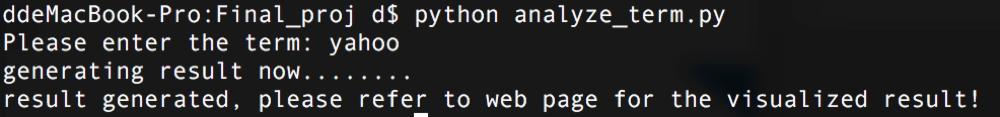
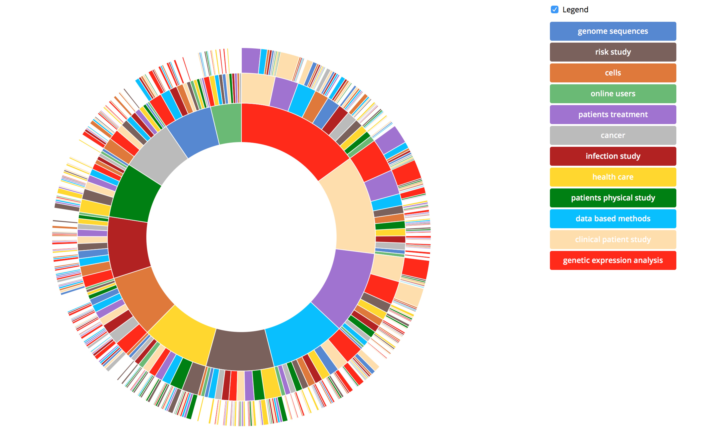
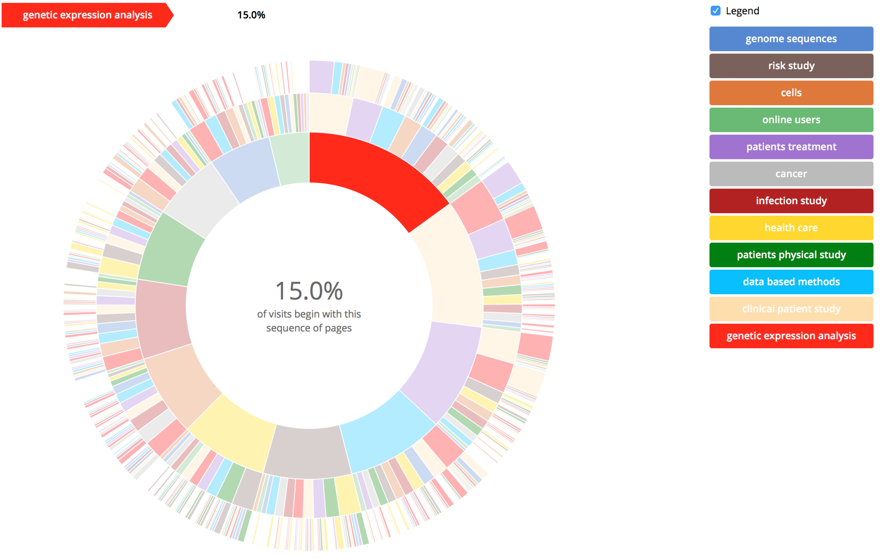
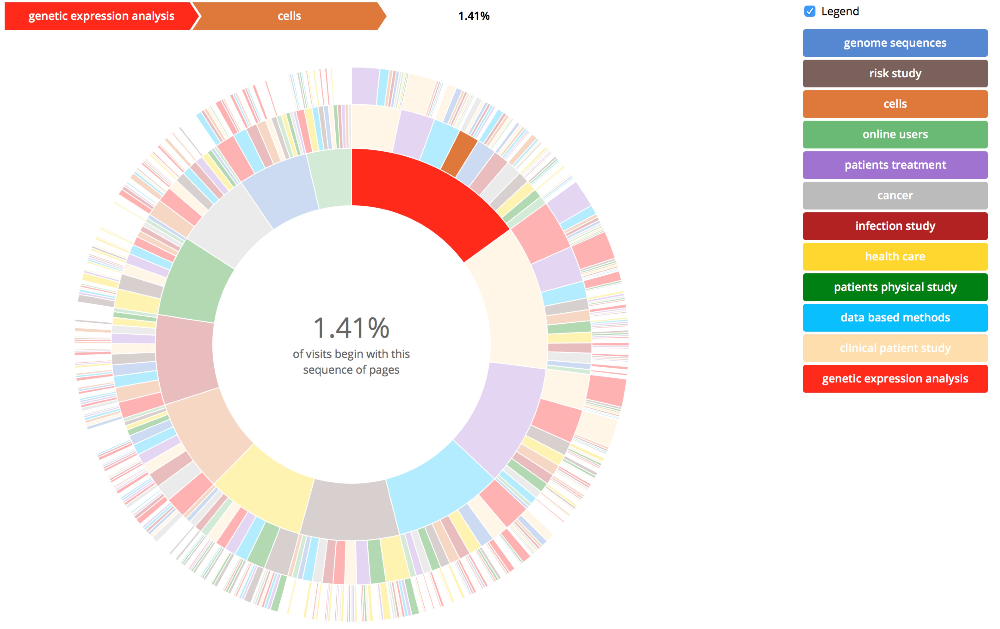
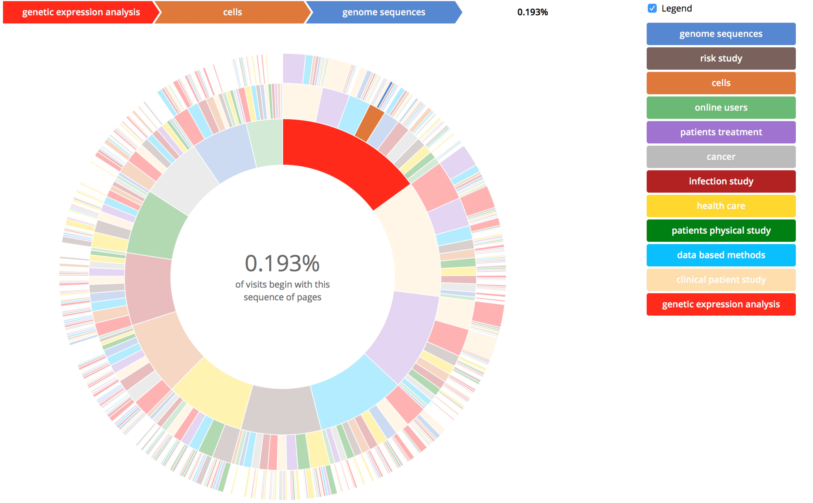
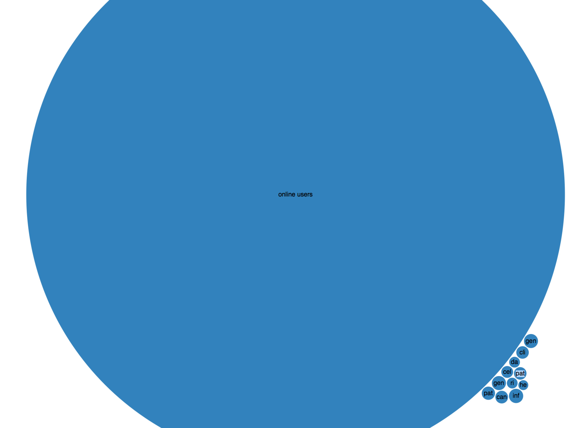

# Pubmed Central Topic Visualization
Hongyi Zhang (hongyiz)
## 1. Introduction
The purpose of this project is to analyze the data of academic paper from PMC Open Access Subset, and extract topics of the papers and then use d3 tools to visualize the results.<br>
The whole process consists of 4 steps: data preparation, data analysis, data transformation, data visualization.
## 2. Data preparation
The purpose the data preparation is to analyze and extract features from the given raw data so that we can conduct machine learning algorithms on the prepared data to extract topics of each paper.The raw data that I used for this project is articles.A-B.tar.gz, which is about 17GB after decompression.<br>
I tried 3 different way of extracting features from the raw data: 1. DBpedia Spotlight 2. extracting keywords fields of papaer 3. extracting abstract fields of paper. Finally I decided to use method 3.
### DBpedia Spotlight
DBpedia Spotlight is a tool for automatically annotating mentions of DBpedia resources in text, providing a solution for linking unstructured information sources to the Linked Open Data cloud through DBpedia. Using DBpedia, we can send a paper to DBpedia via http request and get a list of keywords for each paper. DBpedia can pretty precisely extract keywords from each paper, and the amount of the keywords extracted for each paper is just suitable for further topic extraction, for example, it extracts 258 keywords from 3_Biotech_2011_Dec_13_1(4)_217-225. Since the keywords can more precisely represent the theme of the article and it can largely reduce the workload on data analysis step, I decided to send every file to DBpedia server and use the returned keywords as the papers' features. The core code for this method is shown as following.<br>


```python
#code for sending a document to DBpedia to extract keywords
def annotate(doc):
    query = doc
    urlPostPrefixSpotlight = "http://spotlight.sztaki.hu:2222/rest/annotate"
    args = urllib.urlencode([("text", query)])
    request = urllib2.Request(urlPostPrefixSpotlight, data=args, headers={"Accept": "application/json"})
    response = urllib2.urlopen(request).read()
    pydict= json.loads(response)
    annotation =  pydict['Resources']

    entries = {}
    for keyword in annotation:
            if keyword["@URI"] not in entries.values():
                entries[keyword["@surfaceForm"]] = keyword["@URI"]
    return entries
```

However, the problem is that the performance of this method is too slow. Because every paper has to be sent to server through network, network speed becomes the bottleneck: only about 700 papers can be processed in an hour, while the whole raw dataset has about 250,000 paper. So in another word, we need to use more than 10 days to finish preparation of the whole dataset, which is obviously unacceptable.<br>
So then I decided to try to use some localized methods to pre-process the dataset.
### Extracting keywords fields of paper
After examining the raw data, I found out that each paper is an nxml file. And I also found that each xml file has a field of kwd-group, which consists of a list of kwd(a.k.a keyword). Those are the keywords which the authors wrote by themselves. Obviously those keywords are the most accurate keywords because those are selected by the authors themselves. So I decided to try doing the data preparation by extracting keywords field in the nxml files.<br>
The process is pretty fast, but the problem is the extracted data becomes too small for further topic extraction. The keywords I extracted for each paper is in an average of 3.796, which means that for each file there are no more than 4 words. It is obviously not enough for a futher topic extraction.
### Extracting abstracts fields of paper
Then I found out that there is another field in nxml file called abstract, which consists of 1 or 2 paragraphs of text. The length of abstract field can statisfy the data we need for topic extraction, and in the meanwhile, since the abstract is the overview of the whole paper, comparing with the whole paper, there's less noise in abstract, which means that it is very likely that topic extraction will have a better outcome on the abstracts.<br>
Finally I chose this method as my formal data preparation method, and the results show that it performs pretty well.<br>
The following is the core code for extracting abstracts and keywords from raw data.


```python
e = xml.etree.ElementTree.parse("articles.A-B/" + direct + "/" + f).getroot()
        keys = ""
        abstract = ""
        for key in e.iter('kwd'):
            if key.text != None:
                try:
                    key.text.decode('ascii')
                    if len(keys) != 0:
                        keys = keys + ','
                    keys = keys + key.text
                except UnicodeEncodeError:
                    print "uho"
        for abst in e.iter('abstract'):
            for p in abst.iter('p'):
                if p.text != None:
                    try:
                        p.text.decode('ascii')
                        abstract = abstract + p.text
                    except UnicodeEncodeError:
                        print "uho"
```

## 3. Data Analysis
### 3.1 Method Selection
For topic extraction, I used Python's scikit-learn package. The overall process of topic extraction is: first I run TF/IDF over each of the abstracts and then I used the matrix output from TF/IDF run into the LDA function. From LDA function's output we can get top n most likely topics, and for each paper we can get top k most related topics.<br>
The reason I choose to use LDA is because LDA is a topic model that allows sets of observations to be explained by unobserved groups that explain why some parts of the data are similar, which is very suitable for this problem.
### 3.2 parameter selection
Although I decided to use TF/IDF + LDA to solve this problem, there are still some parameters waiting for setting: number of topics and number of keywords in each topic.<br>
number of topics: Since I plan to visualize to topics, the number of topics shouldn't be too large or the clients will be overwhelmed by a lot of small bars or circles. Besides, to differentiate different topics in visualization, we need to give each topic a different color, while too many topics will make it difficult to assign different color to every topic. For this reason, I set the final number of topics to 12.<br>
number of keywords in topics: First I tried to use only 1 keyword in every topic, and the result is shown as below:<br>


```python
Topic 0: disease
Topic 1: hiv
Topic 2: imaging
Topic 3: quality
Topic 4: health
Topic 5: cells
Topic 6: gene
Topic 7: cell
Topic 8: genetic
Topic 9: protein
Topic 10: disease
Topic 11: 170
```

From the above results we can see that setting the number of words to 1 is too coarse -- we have topics cells and cell, gene and genetic, and the worst, just a number 170.<br>
For this reason, I decide to set the number of keywords to 5. And the results are shown as below.<br>


```python
Topic 0: species genome sequence sequences proteins
Topic 1: risk study women hiv age
Topic 2: cells cell expression protein human
Topic 3: available article 10 users online
Topic 4: patients title compound disease treatment
Topic 5: cancer patients breast tumour survival
Topic 6: study acid used activity infection
Topic 7: health care study research patients
Topic 8: study physical patients activity group
Topic 9: data based method methods model
Topic 10: patients surgery clinical study patient
Topic 11: genes gene expression genetic analysis
```

The above result seems much better. There are no topics overlapped, and each topic can be interpreted to some meaningful topic. So I finally set the number of keywords to 5.<br>
After extracting the topics from paper, we also generate 3 most related topics for each paper using LDA. For each paper, I generated the following triple:<br>
3_Biotech@3_Biotech_2011_Dec_14_1(4)_239-245: [ 0 11 10]<br>
Each number indicates a topic that it is related to.<br>
The following is the core code for topic detection.


```python
vectorizer = CountVectorizer(analyzer='word', ngram_range=(1,1), min_df = 0, stop_words = 'english')
matrix =  vectorizer.fit_transform(corpus)
feature_names = vectorizer.get_feature_names()
 
vocab = feature_names
 
model = lda.LDA(n_topics=12, n_iter=500, random_state=1) #30 for abstracts
model.fit(matrix)
topic_word = model.topic_word_
n_top_words = 6
 
for i, topic_dist in enumerate(topic_word):
    topic_words = np.array(vocab)[np.argsort(topic_dist)][:-n_top_words:-1]
    print('Topic {}: {}'.format(i, ' '.join(topic_words)))

doc_topic = model.doc_topic_
```

### 3.3 Building model for user input terms
Since I need to build a program which can take user input terms and then output the possible topics this term occurs in, I will extract the matrix calculated by LDA model(the matrixs stores the feature words and each words' likelihood of belonging to some topics) and store it in a csv file.<br>
The core code is shown as below.


```python
doc_topic = model.doc_topic_
with open('model.csv', 'wb') as csvfile:
    csv_writer = csv.writer(csvfile, delimiter=',')
    csv_writer.writerow([x.encode('utf-8') for x in feature_names])
    for y in range(len(model.topic_word_)):
        csv_writer.writerow([x for x in model.topic_word_[y]])
```

## 4. Data Transformation
### 4.1 relationships between topics
The purpose of this part of data visualization is to demonstrate the possibilities of each word's co-occurance with a certain word. So I need to compute how many times every combinations of 3 topics occur and then use the occurance count as the probability of this occurance pattern.<br>
Then in order to show my results in d3, I need to process the data and put it into a flare json format.<br>
The structure of flare is that every node has a name attribute and a list of children node. And the leaf node has an attribute of size. So for combination [0, 1, 2] with occur 123 times, it will be transformed to:


```python
{name : "1",
 [	{name : "2",
	 [	{name : "3",
	 	 size : 123}
	 ]
	}
 ]
}
```

In the meantime, for each topic I interpreted it into human readable phrases.


```python
Topic 0: genome sequences
Topic 1: risk study
Topic 2: cells
Topic 3: online users
Topic 4: patients treatment
Topic 5: cancer
Topic 6: infection study
Topic 7: health care
Topic 8: patients physical study  
Topic 9: data based methods
Topic 10: clinical patient study
Topic 11: genetic expression analysis
```

The core code for data transformation is as following:


```python
def add_to_matrix(matrix, strs):
  if (strs[0] in matrix.keys()) == False:
    #print "into here"
    matrix[strs[0]] = {}
  if (strs[1] in matrix[strs[0]].keys()) == False:
    matrix[strs[0]][strs[1]] = {}
  if (strs[2] in matrix[strs[0]][strs[1]].keys()) == False:
    matrix[strs[0]][strs[1]][strs[2]] = 0
  matrix[strs[0]][strs[1]][strs[2]] += 1

def matrix_to_json(matrix):
  json_dict = {}
  json_dict['name'] = 'root'
  json_dict['children'] = []

  for key1, item1 in matrix.iteritems():
    element1 = {}
    element1['name'] = key1
    element1['children'] = []
    for key2, item2 in item1.iteritems():
      element2 = {}
      element2['name'] = key2
      element2['children'] = []
      for key3, item3 in item2.iteritems():
        element3 = {}
        element3['name'] = key3
        element3['size'] = item3
        element2['children'].append(element3)
      element1['children'].append(element2)
    json_dict['children'].append(element1)

  return json.dumps(json_dict)
```

### 4.2 Topic predictions from input terms
To predict the related topics based on the user's input term and visualize the result to users, each time user inputs a term, I will search it in the csv, and find the corresponding likelihood that it belongs to each topic, and then store it in a flare json structure.<br>
The core code for this process is shown as below.


```python
import csv
import json

term = raw_input("Please enter the term: ")
print "generating result now........"
scores = []
with open("model.csv", "r") as modelfile:
    reader = csv.reader(modelfile, delimiter = ",")
    count = 0
    for x in reader.next():
    	if x == term :
    		break
    	count += 1
    for row in reader:
    	scores.append(row[count])

name_dict = {"0": "genome sequences", "1": "risk study", "2": "cells", "3": "online users",\
             "4": "patients treatment", "5": "cancer",\
              "6": "infection study", "7": "health care", "8": "patients physical study",\
              "9": "data based methods", "10": "clinical patient study", "11": "genetic expression analysis"}
dic = {'name' : 'root', 'children' : []}

for i in range(0, len(scores)):
	score = scores[i]
	dic['children'].append({'name' : name_dict[str(i)], 'size' : float(score)})

with open("flare_term.json", 'w+') as outfile:
  outfile.write(json.dumps(dic))

print "result generated, please refer to web page for the visualized result!"
```

And the program is shown as below.<br>


## 5. Data Visualization
Finally I used d3 to visualize my results.
### 5.1 relationships between topics

As the above picture show, the circle has 3 layers, and every layer is divided into sections representing a topic. Larger section represents a more often occuring topic.
And the following pictures show that the web page can show the probability of the selected combination of topics occur together.



### 5.2 Topic predictions from input terms
This web page will take the json data generated in 4.2. And the area of the circle indicates the likelihood that this term belongs to the topic this circle represents. The following graph is generated on the word 'yahoo'.

## 6. Summary
### 6.1 Information Obtained
From the first topic-relationship graph, we can find out a lot of useful informations about each topic, and the relations between topics. For example, topic 'genetic expression analysis' occurs the most, the this topic is most likely to occur with topic 'clinical patient study' the most.<br>
And from the second graph, we can clearly see that which topic this word may most likely come from.
### 6.2 Future work
In the future we can do more analysis about relationships about different works. For example, with a given word, what are the most likely occuring words within the most likely topics?
